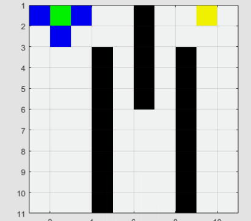
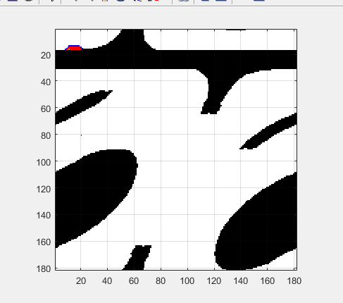
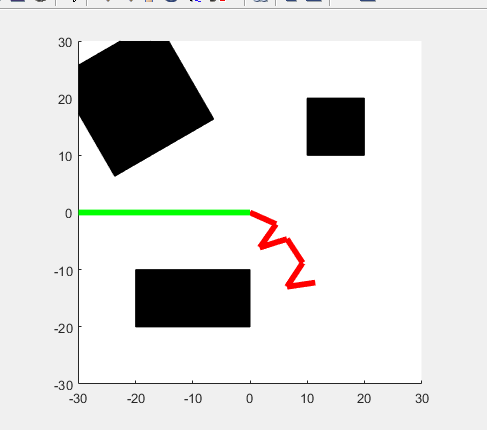
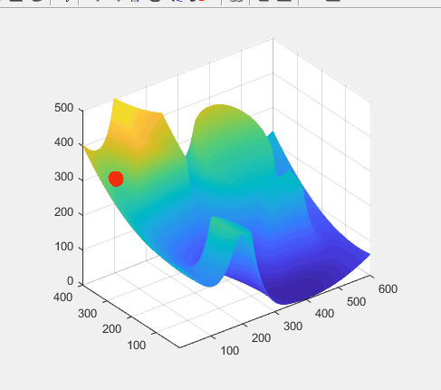

# Robot-Motion-Planning
**Based on the online course from Upenn "Computational Motion Planning"**

In `Astar_Dijiktra_GridWorld)`  

**Dijkstra**

**A***

### Robot Arm Example

In `Robot_Arm/`

**Dijkstra Planning**

  

**A* Planning**

In `Probability_Road_Map`

**Probability Road Map planning for 6-link robot arm**

In `Artificial_Potantial_Field`

**Aritificial Potantial Field motion planning for a ball**

